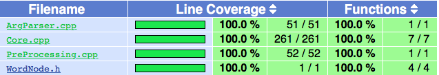

# Project1-B

蒋越 PB16001821

莫定衡 PB16001716

吴昊 PB16001800

# 1. 预处理模块(PreProcessing.cpp)

## 实现原理

这里将先前写好的代码直接拷贝到文件中，并且提取出参数作为该模块的api

```c++
class PreProcessing{
    public:
        static void process(istream &infile, vector<string> &WordChain)
```

注：这里写成 static 是因为该函数是整个类共有的，而不是每个实例独有的；此外，main函数中并没有PreProcessing类的实例，因此写作静态。

接口含义：infile 代表输入流，原始的文件流赋值给infile；而WordChain是输出结果，用引用来更改它的值以起到返回结果的效果。（其实也可以设计为返回值，但是在其他模块可能要返回多个值，而返回多个值（tuple）要用到C++11的语法特性，为了避免麻烦就暂时用引用来处理了）

然后我们特地把参数infile的类型定义为istream，(原类型为ifstream)，原因是为了单元测试时候方便利用参数的多态性。即：main函数调用该模块时传入的参数是ifstream类型，而单元测试调用时传入的是istringstream类型。这样文件的读写测试就可以绕过文件系统，直接以字符串进行读写。

此外，这里还要用到我们定义的一个结构体（类）WordNode `#include "WordNode.h"`，它的定义如下：

```c++
#include <vector>

#ifndef WORDNODE_H
#define WORDNODE_H 1

class WordNode{
public:
    char prefix;
    char suffix;
    std::vector <std::string> wordlist;
    int word_count;
    int word_use;
};

#endif
```

这里用到了#ifndef WORDNODE_H宏，其作用是：

为了保证该结构体只被定义一次，而不会反复定义导致编译错误。

(#pragma once可以起到同样的效果)

## 单元测试

测试样例如下：

1. `i have a pen, i have an apple。ah, apple pen.`

   测试其常规功能，结果应当为`"have", "pen", "an", "apple", "ah" `

   测试代码如下：

   ```c++
   TEST(preprocessing_test, RemoveDuplicate){
       istringstream test_stream("i have a pen, i have an apple。ah, apple pen.");
       vector<string> vocabulary;
       PreProcessing::process(test_stream, vocabulary);
       
       vector<string> expected = { "have", "pen", "an", "apple", "ah" };
   
       ASSERT_EQ(vocabulary, expected);
   }
   ```

   

2. `i have a PeN, i hAve aN aPplE。ah, appLE pen.`

   测试其过滤大写字母的功能，结果同上，为`"have", "pen", "an", "apple", "ah" `

   测试代码类似，略

3. 空

   测试其应对异常的能力，应当抛出异常`invalid_argument("no word found in text!")`

   ```c++
   TEST(preprocessing_test, NullTest){
       istringstream null_stream;
       vector<string> vocabulary;
       try{
           PreProcessing::process(null_stream, vocabulary);
           FAIL(); // 不抛出异常，失败
       }
       catch(invalid_argument const& err){
           EXPECT_EQ(err.what(), string("no word found in text!"));
       }
       catch(...){
           FAIL(); // 抛出其他异常，失败
       }
   }
   ```

# 2. 命令行参数分析模块(ArgParser.cpp)

## 实现原理

将先前写在 main 函数内的代码经过整理，得到 ArgParser 类：

```c++
class ArgParser{
    public:
        static void parse(int argc, char *argv[],
        string &filename, char &head, char &tail, int &num, bool &word_flag, bool &char_flag, bool &num_flag){
```

其中 `int argc`, `char *argv[]` 是直接读取传入 main 函数的命令行参数

`string &filename `是文件名

 `char &head `和  `char &tail` 分别是规定的首尾字母

 `int &num` 是指定单词链的长度

 `bool &word_flag` 代表 `-w` 开关

 `bool &char_flag` 代表 `-c` 开关

 `bool &num_flag` 代表 `-n` 开关

这些接口本来是以变量的形式写在 main 函数里的，但是由于单元测试覆盖不到 main 函数，因此我们要尽量将 main 函数简化，最好只剩下模块调用。这样在集成测试的时候也方便 debug。

## 单元测试

测试样例如下：

1. `-w test.txt`

    -w 开关

2. `-c test.txt`

    -c 开关

3. `-w -n 114514 test.txt`

    -n 能否返回正确数字

4. `-w test.txt -h a`

   能否返回正确的头字符

5. `-w test.txt -h A`

   能否忽略头字符大小写

6. `-w test.txt -t a`

   能否返回正确的尾字符

7. `-w test.txt -t A`

   能否忽略尾字符大小写

8. `-w test.txt -h aa`

   能否抛出头字母长度异常

9. `-w test.txt -t aa`

   能否抛出尾字母长度异常

10. `-w test.txt -h 3`

    能否抛出头字母不在 ascii 范围内

11. `-w test.txt -t 3`

    能否抛出尾字母不在 ascii 范围内

12. `test.txt`

    抛出未选定工作模式异常(至少选择 -w 或 -c 的一种)

13. `test.txt -w -c`

    抛出工作模式冲突异常(无法同时 -w 和 -c)

14. `test.txt -c -n 114514`

    抛出未实现异常(并未要求实现 -c -n 同时使用的情形)

# 3. 核心模块 (Core.cpp)

## 实现原理

将原函数写入 Core 类中，并声明为 private 函数

然后将封装好的接口声明为 public 函数

### 1. `gen_chain` 函数

```c++
public:
	static int gen_chain(vector<string> words, vector<string> &result)
```

该函数调用了私有成员函数：

```c++
private:
		static int most_word(int if_start, int start, int &length ,int &max_length, int start_char, int end_char, WordNode num_matrix[][26], vector<int> &result, vector<int> &temp_result) 
```

该私有函数是未封装前的函数实现，其接口复杂且可读性差。为了满足 `gen_chain` 函数相应接口的需求，在 `gen_chain` 中使用下列参数调用了 `most_word` 函数：

```c++
int n = most_word(1, 0, length, max_length, 0, 0, WordMatrix, int_result, temp_result);
```

(length 和 max_length 是一个占位符，并没有实际作用)

### 2. `gen_chain_char` 函数

其接口为：

```c++
public:
	static int gen_chain_char(vector<string> words, vector<string> &result, char head, char tail)
```


其内部实现为：

```c++
private:
	static int most_char(int if_start, int start, int &length, int &max_length, int start_char, int end_char, WordNode num_matrix[][26], vector<int> &result, vector<int> &temp_result) 
```

按以下参数调用内部函数：

```c++
most_char (1, 0, length, max_length, head_int, tail_int, WordMatrix, int_result, temp_result);
```

### 3. `gen_chain_word` 函数

接口：

```c++
public:
	static int gen_chain_word(vector<string> words, vector<string> &result, char head, char tail) 
```

实现方法是调用了 `most_word` 函数 (在 `gen_chain` 中提到过)

```c++
int n=most_word(1, 0, length, max_length, head_int, tail_int, WordMatrix, int_result, temp_result);
```

其中 `head_int = head - 'a'`, `tail_int = tail - 'a'`

### 4. `gen_chain_n_word` 函数

接口：

```c++
public:
	static void gen_chain_n_word(vector<string> words, int num, ostream &outfile)
```

调用内部函数:

```c++
static void n_word(int if_start, int start, int &length, int n_length, int &n, WordNode num_matrix[][26], vector<string> &temp_result, ostream &outfile)
```

调用方式:`n_word(1, 0, length, num, n, WordMatrix, temp_result, outfile);`

## 单元测试

### 1. `gen_chain` 函数测试

- 空输入测试

- 单词链循环测试

  - 输入为"aab", "bbc", "ccd", "dda"
  - 输出应为"aab", "bbc", "ccd", "dda"

- 单字母循环测试

  - 输入："a", "aa", "aaa", "aaaa"

  - 输出："aaaa", "aaa", "aa", "a"

    （算法将开头和结尾字母属于同一节点的不同单词按字母长度降序排列）

- 更大的单字母循环测试

  - 输入：

    ```c++
    "a","aaa","aa","aaaaaaaaaaaa","aaaaaaaaa",
    "aaaaaaaaaaaaaaaaaaaaaaa","aaaaa","aaaaaaaa", 
    "aaaaaaaaaaaaaaaaaaaaaaaaaaaaaa","aaaaaaaaaaaaaaaaaaaaa",
    "aaaaaaaaaaaaaaaaaaa","aaaaaaaaaaaaaaaaaaaaaaaaa",
    "aaaaaaaaaaaaaaaaaaa","aaaaaaaaaaaaaaaaaaaaaaa",
    "aaaaaaaaaaaaaaaaaaaaaaaaaaaaaaaaaaaaaaa","aaaaaaa","aaaaaaaa",
    "aaaaaaaaaaaaaaaaaaaaaaaaaaaaaaaaaaaaaaaaaaaaaaaaa",
    "aaaaaaaaaaaaaaaaaaaaa"
    ```

  - 输出：

    ```c++
    "aaaaaaaaaaaaaaaaaaaaaaaaaaaaaaaaaaaaaaaaaaaaaaaaa",
    "aaaaaaaaaaaaaaaaaaaaaaaaaaaaaaaaaaaaaaa", "aaaaaaaaaaaaaaaaaaaaaaaaaaaaaa",
    "aaaaaaaaaaaaaaaaaaaaaaaaa", "aaaaaaaaaaaaaaaaaaaaaaa", "aaaaaaaaaaaaaaaaaaaaaaa",
    "aaaaaaaaaaaaaaaaaaaaa", "aaaaaaaaaaaaaaaaaaaaa", "aaaaaaaaaaaaaaaaaaa", "aaaaaaaaaaaaaaaaaaa",
    "aaaaaaaaaaaa", "aaaaaaaaa", "aaaaaaaa", "aaaaaaaa", "aaaaaaa", "aaaaa", "aaa", "aa", "a"
    ```

    

### 2. `gen_chain_char` 函数测试

- 空输入测试

- 区分单词链长度和单词字符数量的测试

  - 输入：

    ```c++
    "ab", "bc", "cd", "de", "ef", "fg", "gh", "hi", 
    "zbakjsdoifajsodjifasjofjksfoasfjoaisdfjaiosdjfosdfjodsajfoisadjfodsfosdjfosdfodsafiodsfioadsjfodsajfiodsj",
    "jlqkjweojojosfjoasjkfojsfosajfl;sjlfsjflsajflksajflsjflasjflasjflsadjflsdjfladsjfkdls"
    ```

  - 输出

    ```c++
    "zbakjsdoifajsodjifasjofjksfoasfjoaisdfjaiosdjfosdfjodsajfoisadjfodsfosdjfosdfodsafiodsfioadsjfodsajfiodsj", "jlqkjweojojosfjoasjkfojsfosajfl;sjlfsjflsajflksajflsjflasjflasjflsadjflsdjfladsjfkdls"
    ```

- 指定头字母测试

  - 输入：

    ```c++
    "ab", "bc", "cd", "de", "ef", "fg", "gh", "hi", 
    "zbakjsdoifajsodjifasjofjksfoasfjoaisdfjaiosdjfosdfjodsajfoisadjfodsfosdjfosdfodsafiodsfioadsjfodsajfiodsj",
    "jlqkjweojojosfjoasjkfojsfosajfl;sjlfsjflsajflksajflsjflasjflasjflsadjflsdjfladsjfkdls"
    
    head = 'j'
    ```

  - 输出

    `"jlqkjweojojosfjoasjkfojsfosajfl;sjlfsjflsajflksajflsjflasjflasjflsadjflsdjfladsjfkdls"`

- 指定尾字母测试

  - 输入

    ```c++
    "ab", "bc", "cd", "de", "ef", "fg", "gh", "hi",     "zbakjsdoifajsodjifasjofjksfoasfjoaisdfjaiosdjfosdfjodsajfoisadjfodsfosdjfosdfodsafiodsfioadsjfodsajfiodsj",    "jlqkjweojojosfjoasjkfojsfosajfl;sjlfsjflsajflksajflsjflasjflasjflsadjflsdjfladsjfkdls"
    ```

  - 输出

    `"zbakjsdoifajsodjifasjofjksfoasfjoaisdfjaiosdjfosdfjodsajfoisadjfodsfosdjfosdfodsafiodsfioadsjfodsajfiodsj"`

- 同节点内单词按长度排序（增加覆盖率）

  - 输入

    ```c++
    "abb", "ab", "abbbbbb", "bc", "cd", "de", "ef", "fg", "gh", "hi",     "zbakjsdoifajsodjifasjofjksfoasfjoaisdfjaiosdjfosdfjodsajfoisadjfodsfosdjfosdfodsafiodsfioadsjfodsajfiodsj",    "jlqkjweojojosfjoasjkfojsfosajfl;sjlfsjflsajflksajflsjflasjflasjflsadjflsdjfladsjfkdls"
    ```

  - 输出

    ```c++
    "zbakjsdoifajsodjifasjofjksfoasfjoaisdfjaiosdjfosdfjodsajfoisadjfodsfosdjfosdfodsafiodsfioadsjfodsajfiodsj", "jlqkjweojojosfjoasjkfojsfosajfl;sjlfsjflsajflksajflsjflasjflasjflsadjflsdjfladsjfkdls"
    ```

### 3. `gen_chain_word` 函数

- 空输入
- 指定字符为空
  - 输入：`"ab", "bc", "cd", "de", "da", "ef"`
  - 输出：`"da", "ab", "bc", "cd", "de", "ef"`
- 指定头字符
  - 输入：`"ab", "bc", "cd", "de", "da", "ef", "fa"`, `head = e`
  - 输出：`"ef", "fa", "ab", "bc", "cd", "da"`
- 指定尾字符
  - 输入：`"ab", "bc", "cd", "de", "da", "ef", "fa"`, `tail = f`
  - 输出：`"da", "ab", "bc", "cd", "de", "ef"`
- 同节点内单词按长度排序
  - 输入：`"abb", "ab", "abbb", "bc", "cd", "de", "da", "ef"`, `head = a, tail = a`
  - 输出：`"abbb", "bc", "cd", "da"`

### 4. `gen_chain_n_word` 函数

- 空输入测试

- 长度为 2 的单词链

  - 输入：`"ab", "bc", "cd", "de", "da", "ef", "fa"`
  - 输出：`"ab bc \nbc cd \ncd da \ncd de \nda ab \nde ef \nef fa \nfa ab \nab bc \n"`

- 长度为 5 的单词链

  - 输入：`"ab", "bc", "cd", "de", "da", "ef", "fa"`

  - 输出：

    ```c++
    string("ab bc cd de ef \nbc cd de ef fa \n") + 
    string("cd de ef fa ab \nda ab bc cd de \nde ef fa ab bc \n") +
    string("ef fa ab bc cd \nfa ab bc cd da \nfa ab bc cd de \nab bc cd de ef \n"
    ```

- 长度为 10 的单词链

  - 输入：`"ab", "bc", "cd", "de", "da", "ef", "fa"`
  - 输出：`""`

- 长度为 2 的单词链，外加同节点内单词排序

  - 输入：`"abb", "ab", "abbb", "bc", "cd", "de", "da", "ef", "fa"`
  - 输出：`"abbb bc \nbc cd \ncd da \ncd de \nda abbb \nde ef \nef fa \nfa abbb \nabbb bc \n"`

# 测试结果



如图所示，几个模块中的每一行代码都能覆盖到，覆盖率高达100%

# 附录1: 测试使用方法

在 test 文件夹下，输入`make preprocessing` 测试 预处理模块 (preprocessing.cpp)

输入 `make argparser` 测试 命令行参数分析模块 (argparser.cpp)

输入 `make core` 测试 核心模块 (core.cpp)

输入 `make all` 或者 `make` 生成覆盖率相关信息（需要安装 LCOV 工具和 GCC 编译器）

# 附录2:命令行参数分析

参考了

1. 该项目：https://github.com/tanakh/cmdline

和

2. 该文章：https://blog.csdn.net/10km/article/details/50982993